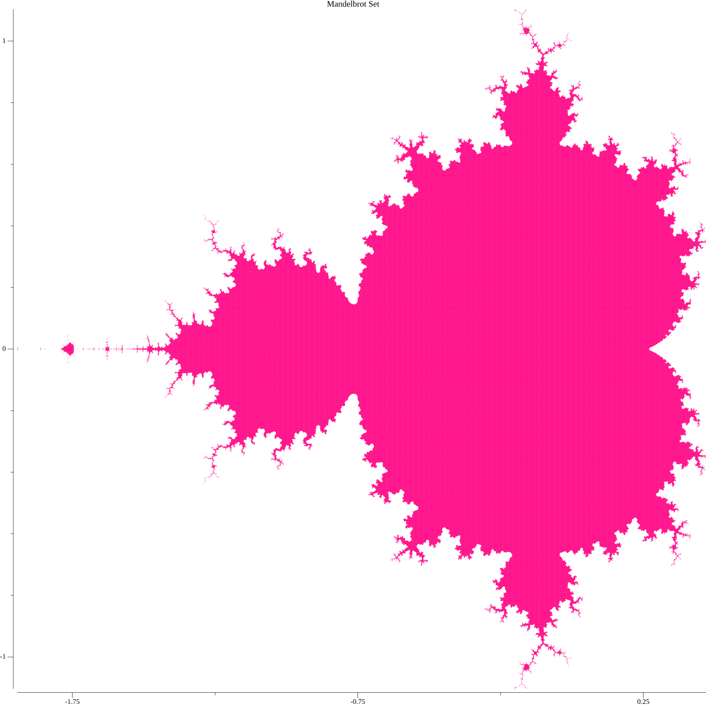

# mandelbrot-tinker
Toy challenge to learn Go.



## Build Status


## How to Use

### Run from a Docker Container
To run the application from a Docker container, use the following command:
```sh
docker run -it --rm 59vkckvlkjdfglkjdfv/mandelbrot-tinker
```

### Build
To build the application, you need the following tools installed:
- Go 1.23 or later
- Docker

#### Required Tools
- [Go](https://golang.org/doc/install)
- [Docker](https://docs.docker.com/get-docker/)

#### How to Develop
1. Clone the repository:
    ```sh
    git clone https://github.com/yourusername/mandelbrot-tinker.git
    cd mandelbrot-tinker
    ```
2. Install dependencies:
    ```sh
    go mod tidy
    ```
3. Run tests:
    ```sh
    go test ./...
    ```
4. Build the application:
    ```sh
    go build -o mandelbrot-tinker
    ```
